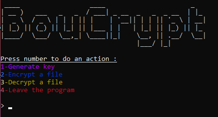

# ⚙BouCrypt⚙

Script to generate key / encrypt / decrypt a file.

Made with python.

Install requirements !

## Features

- Generate a key
- Encrypt a file
- Decrypt a file
- (leave the program)

##  Warning !
 
When the program asks for the file name, you can take several actions:

DON'T FORGET THE EXTENSION

- File path: C:/desktop/file.txt

- Enter the file name if it is in the same directory as the program.

- If it is not, the program will search for the file throughout your computer. (it searches in C://)

## Screenshot
Menu :

## 🚀 About Me
I am a beginner programmer.

If you have any advice to improve my skills ,ideas to enhance my program or suggestions for creating new program, you can write me :

My discord : .bou_bou_

